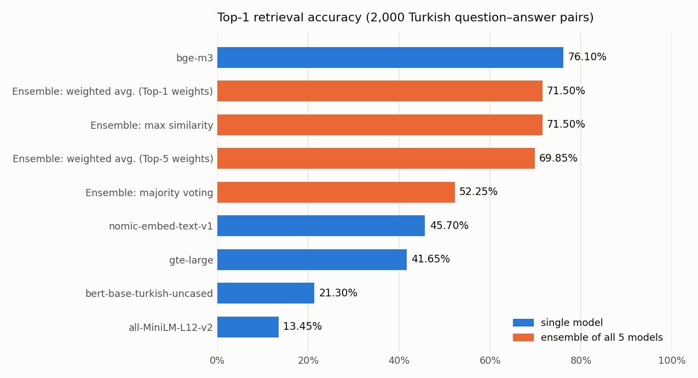

# Ensembles of Embedding Models for Turkish Question–Answer Retrieval

This project compares **five embedding models** on a Turkish semantic search task: for each question, the correct answer has to be found among 2,000 candidates using cosine similarity. The models are then combined with **ensemble methods** (weighted average, majority voting, max similarity) to test whether combining them helps.

**Key result:** the multilingual **BAAI/bge-m3** model reaches **76.1% Top-1 / 87.8% Top-5** accuracy. **No ensemble beat it.** Averaging in weaker models pulled the best ensemble down to 71.5%.



---

## Setup

- **Data:** 2,000 random question–answer pairs from [`merve/turkish_instructions`](https://huggingface.co/datasets/merve/turkish_instructions). The instruction and input fields form the question, and the output field is the answer.
- **Retrieval:** each question and answer is embedded, then a 2,000 × 2,000 cosine-similarity matrix is computed. The answers are ranked for each question.
- **Metrics:** Top-1 accuracy, Top-5 accuracy and Mean Reciprocal Rank (MRR).

### Models

| Model | Notes |
|---|---|
| [`BAAI/bge-m3`](https://huggingface.co/BAAI/bge-m3) | Multilingual, dense vectors via `FlagEmbedding` |
| [`nomic-ai/nomic-embed-text-v1`](https://huggingface.co/nomic-ai/nomic-embed-text-v1) | Long-context embedding model |
| [`thenlper/gte-large`](https://huggingface.co/thenlper/gte-large) | General text embeddings |
| [`dbmdz/bert-base-turkish-uncased`](https://huggingface.co/dbmdz/bert-base-turkish-uncased) | Turkish BERT with mean pooling (not trained for sentence similarity) |
| [`sentence-transformers/all-MiniLM-L12-v2`](https://huggingface.co/sentence-transformers/all-MiniLM-L12-v2) | English-only sentence encoder, used as a baseline |

### Ensemble methods

- **Weighted average:** a weighted sum of the five similarity matrices. The weights come from each model's Top-1 or Top-5 accuracy.
- **Majority voting:** each model votes with its Top-1 answer.
- **Max similarity:** the highest similarity across models is used for each question–answer pair.

---

## Results

| Method | Top-1 | Top-5 | MRR |
|---|---|---|---|
| **bge-m3** | **76.10%** | **87.80%** | **80.85%** |
| nomic-embed-text-v1 | 45.70% | 58.85% | 50.67% |
| gte-large | 41.65% | 55.30% | 46.82% |
| bert-base-turkish-uncased | 21.30% | 33.50% | – |
| all-MiniLM-L12-v2 | 13.45% | 20.00% | 15.94% |
| *Ensemble: weighted average (Top-1 weights)* | 71.50% | 83.25% | 76.15% |
| *Ensemble: max similarity* | 71.50% | 83.25% | 76.15% |
| *Ensemble: weighted average (Top-5 weights)* | 69.85% | 82.50% | 74.81% |
| *Ensemble: majority voting* | 52.25% | 68.25% | 57.01% |

### Findings

- **Multilingual training matters most.** bge-m3 is far ahead. The English-only MiniLM and the general-purpose Turkish BERT (mean-pooled, not trained for similarity) are close to unusable for retrieval.
- **Ensembles only help when the members have similar strength.** One model is much stronger than the rest here, so every combination adds noise and does worse than bge-m3 alone. Majority voting suffers most, because the weaker models outvote the strong one.
- **Weighting by accuracy works better than equal voting.** It recovers most of the gap (71.5% vs. 52.3%). A natural next step would be to learn the weights on a validation split, or to ensemble only the top two or three models.

---

## Repository structure

```
├── notebooks/
│   └── ensemble_semantic_search.ipynb   # embeddings, single-model evaluation, ensembles
├── figures/
└── requirements.txt
```

## Getting started

```bash
git clone https://github.com/ezgiieyice/ensemble-embeddings-semantic-search.git
cd ensemble-embeddings-semantic-search
pip install -r requirements.txt
jupyter notebook notebooks/ensemble_semantic_search.ipynb
```

- Everything runs on a CPU. Embedding 4,000 texts takes 4–12 minutes per model, and a GPU speeds this up considerably.
- The similarity matrices of each model are saved as pickle files, which the ensemble section then loads. These files are not included in the repo.

## Tech stack

Python · PyTorch · Hugging Face Transformers · Sentence-Transformers · FlagEmbedding · scikit-learn · NumPy · pandas · Matplotlib

---

*Assignment for the graduate course **Ensemble Learning** at Yıldız Technical University.*
